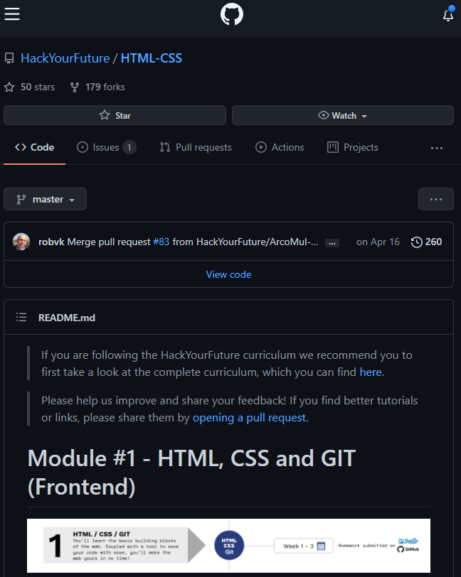
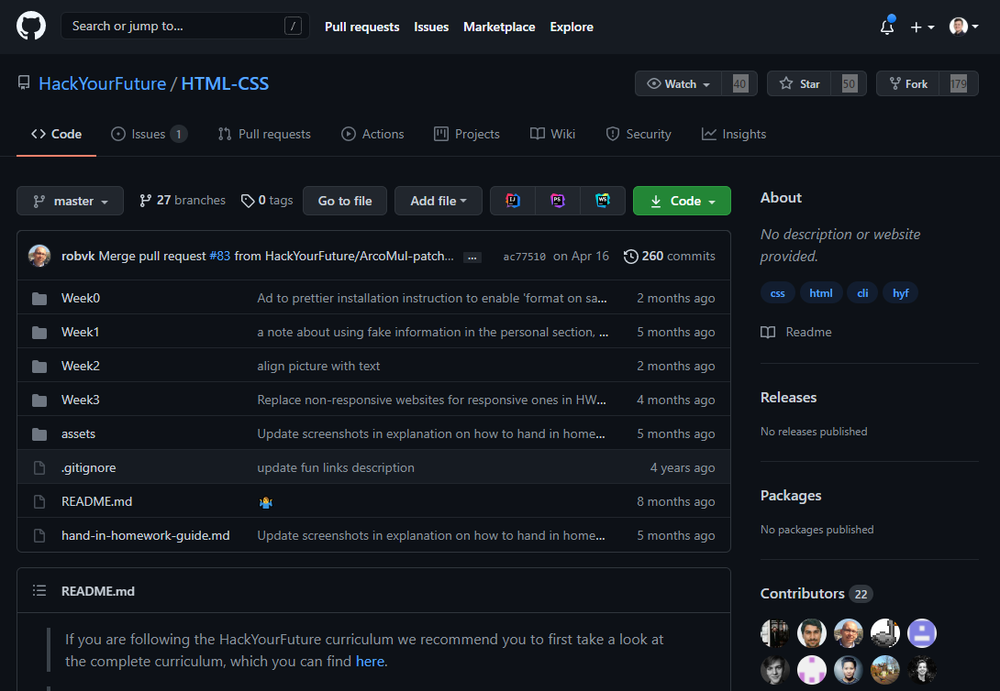

# Github Clone

## todo

- [x] Create a repo
- [ ] Push my commits
- [ ] Add html
- [ ] create css files

## Goal

We are going to rebuild a github page from hackyourfuture

This is the mobile state we are trying to achieve

This is the desktop state we are trying to achieve

# How to install this repo
